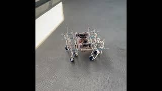
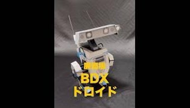

# 🎉 ようこそ

ここでは自作ロボットやWebアプリの写真・動画リンクをまとめています。  

---

## 🔆 メカナムすべり脚を使った全方向移動ロボ
  
[▶️ 動画はこちら](https://www.youtube.com/watch?v=w93T7-Qr38A)

---

## 🤖 BDXドロイド（廉価版） / BDX Droid (Budget Version)
  
[▶️ 動画はこちら](https://youtube.com/shorts/CpPAxEXGy38)

---

## 🤩 任意の人に任意のことを喋らせる装置
  
[▶️ 動画はこちら](https://www.youtube.com/watch?v=lDnROluvNLw)

---

## 📚 Idioms & Allusions
英語の成句・典拠を学ぶための Web アプリ。  
CSV を読み込み、成句・意味・由来・例文を表示し、英語音声で読み上げできます。  

[▶ アプリを開く](https://katabomb.github.io/idioms-allusions/IdiomsAllusions.html)

---

## 🏷️ Address Label Maker (Sample)
愛媛県医療機関データ（ダミー）を使った宛名ラベル印刷 Web アプリ。  
読み仮名で検索し、編集して、はがきや封筒用のラベルを印刷できます。  

[▶ アプリを開く](https://katabomb.github.io/Address-Label-Maker-Sample/index.html)

---
